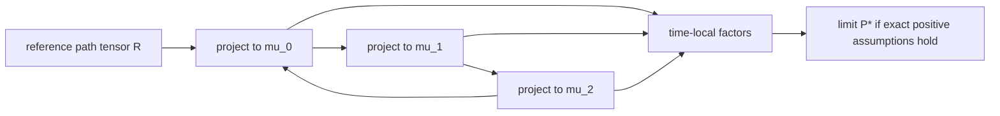

经典 Schrödinger Bridge 同时固定了许多选择：连续状态、两个时间边缘、概率质量守恒、
独立粒子、Euclidean Brownian reference，以及没有反射边界。现代扩展往往只替换其中
一项。真正稳定的主线不是某个 SDE 公式，而是

```text
reference path law + constraint set + path-space entropy
-> factor/transform or projection
-> assumptions needed for existence and computation.          (0.1)
```

本章逐项改变假设。不同扩展可以共享 KL 几何，却不能因此拼成一个无条件的统一定理。

## 1. 哪些结构可能保留

给定 reference path law `R` 与约束集 `C`，抽象问题仍是

```text
P* = argmin {H(P|R): P in C}.                                 (1.1)
```

改变状态空间或约束后，应依次检查四件事：

1. `R` 是否真的是一个非爆炸、归一化的 path law；
2. `C` 是否非空，且至少包含一个有限熵候选；
3. optimizer 是否存在、唯一，是否仍有乘法 factorization 或 Markov transform；
4. 所用迭代究竟是 exact I-projection，还是 learned/finite approximation。

这四问比“方法名里是否含 bridge”更可靠。

## 2. 从 diffusion drift 到 CTMC jump-rate transform

### 2.1 Reference generator

先取有限状态集 `E={1,...,n}`，reference CTMC 的 generator 为 `Q=(q_ij)`：

```text
q_ij >= 0  (i != j),        q_ii = -sum_{j != i} q_ij.        (2.1)
```

令正 terminal potential 为 `g`，定义 space-time harmonic function

```text
h_t(i) = E_R[g(X_T) | X_t=i]
       = [exp((T-t)Q)g]_i.                                   (2.2)
```

它满足 backward equation

```text
partial_t h_t + Q h_t = 0,       h_T=g.                       (2.3)
```

### 2.2 Doob transform of rates

对 `i != j`，正 `h`-transform 的 jump rate 是

```text
q^h_t(i,j) = q_ij h_t(j)/h_t(i),                              (2.4)
q^h_t(i,i) = -sum_{j != i} q^h_t(i,j).                        (2.5)
```

推导只需比较一个短时间步：reference 从 `i` 跳到 `j` 的概率为
`q_ij dt+o(dt)`，terminal weight 的条件比值为 `h_t(j)/h_t(i)`。归一化后得到
(2.4)，对角项由 row sum 为零决定。

这就是 jump process 中与 `a grad log h` 对应的对象，但两者不是同一种“score”：
这里没有 Euclidean gradient。若 `q_ij=0`，则 `q^h_t(i,j)=0`，transform 不会创造
reference graph 中不存在的边。

### 2.3 从一个 transform 到双端 SB

若 path density 具有

```text
dP*/dR = f(X_0) g(X_T),                                      (2.6)
```

则 forward rates 由 terminal factor `g` 的 (2.2)--(2.5) 给出；backward 描述同理由
initial factor `f` 给出。端点 factors 仍需解 Schrödinger system。有限、正模型中这与
B3/B4 完全平行；在 countable graph 上，还必须另证 summability、nonexplosion 与
factor integrability。[Léonard 2017](https://doi.org/10.1515/9783110550832-006 "官方论文页面")
承担的是带明确 generator/regularity 假设的 graph 结论，不是任意 jump process 定理。

## 3. 从两个边缘到多个观测时间

### 3.1 Problem and factorization

在离散时间 `t_0<...<t_m` 上给定 reference path tensor
`R(i_0,...,i_m)>0`，并要求若干时刻的边缘为 `mu_k`：

```text
min H(P|R),       P_{t_k}=mu_k  for k in K.                    (3.1)
```

有限正情形的 Lagrange multiplier 推导给出

```text
P*(i_0,...,i_m)
  = R(i_0,...,i_m) product_{k in K} f_k(i_k).                  (3.2)
```

双端 factors 因而推广为 time-local factors。注意：多个 one-time marginals 仍没有给出
它们的 joint temporal coupling；正是 `H(P|R)` 相对 reference 选择该 coupling。

### 3.2 Tensor IPF

对某个约束时刻 `t_k`，exact I-projection 只需做 marginal rescaling：

```text
P^+(i_0,...,i_m)
 = P(i_0,...,i_m) mu_k(i_k)/P_{t_k}(i_k).                     (3.3)
```

循环访问各 `k in K` 就得到 tensor IPF。正有限、交集非空时，B7 的 cyclic KL
projection 几何仍适用。每个 half-step 有 Pythagorean identity；但这不能自动证明
连续状态 partial-observation 算法的存在性、零噪声极限或 neural implementation 收敛。

[Chen et al. 2019](https://doi.org/10.1007/978-3-030-26980-7_75 "官方论文页面")
提供 inertial/partial-observation 代表模型。正文只使用其实际证明的模型与算法结构，
不把未给出的完整 convergence theorem 补写出来。

### 3.3 Constraint flow



图 3.1 的环表示 constraint sets 的循环，不表示已知完整 trajectory labels。

## 4. Discrete、categorical 与 graph 不是同义词

至少要区分：

| 对象                | 时间         | reference primitive         | 对应 field               |
| ----------------- | ---------- | --------------------------- | ---------------------- |
| categorical chain | discrete   | transition matrix           | transition ratio/logit |
| CTMC              | continuous | jump generator              | rate ratio (2.4)       |
| graph diffusion   | 视模型而定      | graph Laplacian/jump kernel | edge flux/rate         |

把连续 diffusion 的 `grad log rho_t` 直接移植到类别标签上没有定义意义。现代 categorical
matching 若没有同时说明 reference transitions、support 与 exact constraint，就只能按其
自身 learned objective 评价，不能由名称继承 SB 结论。

## 5. Soft constraints 与 unbalanced mass

### 5.1 Soft terminal constraint

一种 soft problem 保持 `P` 为概率 law，但把 hard terminal equality 改为 penalty：

```text
min_{P:P_0=mu_0}
  H(P|R) + beta KL(P_T||mu_T).                                (5.1)
```

`beta` 有限时，`P_T` 一般不等于 `mu_T`。Garg--Zhang--Zhou 2024 的
[source note](https://arxiv.org/abs/2403.01717 "官方论文页面")
记录了其非退化 diffusion、domination/regularity 和 positive-kernel 条件。该工作仍是
preprint；其 exact objective 不提供 finite neural solver 的收敛保证。

### 5.2 Killing and a coffin state

unbalanced SB 的另一条路线允许 live mass 因 killing 改变。把 cemetery state `dagger`
加入状态空间后，live plus dead 的总质量重新归一化为一，问题可以写成 augmented path
space 上的 ordinary entropy projection。对应控制同时改变 drift 与 killing rate。

[Chen--Georgiou--Pavon 2022](https://doi.org/10.1137/21M1447672 "官方论文页面")
承担 diffusion with killing、绝对连续 live marginals 和 elliptic covariance 范围内的结果。
它不覆盖任意 birth/branching、signed mass 或所有“unbalanced OT”定义。

因此

```text
soft mismatch penalty != killing/coffin-state mass change.    (5.2)
```

## 6. Mean-field：reference 本身依赖 law

经典问题中的 `R` 固定且线性。mean-field interaction 中，candidate law `P` 可能生成
自己的 McKean--Vlasov reference `Gamma(P)`，形式上出现

```text
I(P) = H(P | Gamma(P)).                                      (6.1)
```

由于 denominator 也依赖 `P`，(6.1) 一般不是固定 reference 下的凸 KL。于是 classical
uniqueness 与线性 Schrödinger factors 不能直接搬用。

[Backhoff et al. 2020](https://doi.org/10.1007/s00440-020-00977-8 "官方论文页面")
在其假设下建立 nonlinear rate function、存在性以及 LDP/control/fluid 对应；它不声称
一般 uniqueness。还要区分两个命题：

```text
empirical-path LDP identifies a mean-field conditional optimizer;
finite controlled particle optimizers converge to that optimizer. (6.2)
```

第二行需要独立 propagation-of-chaos/control 结果。
[Hernández--Tangpi 2025](https://doi.org/10.1137/23M1566716 "官方论文页面")
给出 finite-`N`/mean-field value 与 FBSDE 传播结论，但 hard endpoint equality 需要文中
displacement-convex penalty 等资格条件；不能删去这些条件后声称无条件收敛。

## 7. Geometry 与 boundary 是 reference 的一部分

### 7.1 Compact manifold

在 compact connected boundaryless Riemannian manifold 上，可取 Brownian heat semigroup
作为 reference。若 heat kernel、factors 与正则性满足来源条件，entropy interpolation
与 transform 可保留。这里的 gradient、divergence 和 Laplacian 都是 manifold 对象。

该结论不自动覆盖 noncompact manifold：stochastic completeness、heat-kernel bounds、
finite entropy 与 factor existence 都需另证。2026 sub-Riemannian 工作因此只标为
`frontier_candidate`，不能承担成熟的一般理论。

### 7.2 Reflected reference

有边界 domain 上，仅写 no-flux/Neumann PDE 不足以定义 path law。reflected SDE 还包含
boundary local time，例如示意式

```text
dX_t = b_t(X_t)dt + sigma dW_t + n(X_t)dL_t.                  (7.1)
```

`L_t` 只在边界增长，`n` 是反射方向。忽略它会把 constrained path law 错写成普通 SDE。
[Caluya--Halder 2021](https://doi.org/10.23919/ACC50511.2021.9482813 "官方论文页面")
给出 reflected interval fixed point 与一般 necessary PDE conditions；原文没有证明任意
smooth domain 上 variational minimizer 的一般 existence，正文也不作该外推。

## 8. 六类扩展的责任矩阵

| 被改变的假设                    | 保留的 exact object                      | 本章验证范围                                        | 仍不能声称                                   |
| ------------------------- | ------------------------------------- | --------------------------------------------- | --------------------------------------- |
| continuous -> jump/graph  | path KL 与 positive transform          | bounded/summable nonexplosive graph reference | arbitrary explosive countable generator |
| two times -> many times   | 多个 affine marginal I-projections      | finite positive tensor                        | general continuous partial observations |
| hard -> soft              | penalized probability endpoint        | stated nondegenerate/positive regimes         | hard endpoint or generic divergence     |
| balanced -> killing       | augmented-space path KL               | coffin-state diffusion with killing           | birth/branching/signed mass             |
| independent -> mean-field | nonlinear entropy/control problem     | source-specific existence/LDP/convex regimes  | general convexity or uniqueness         |
| no boundary -> reflected  | reflected reference and boundary flux | interval/necessary PDE bounded results        | general reflected minimizer existence   |

完整 theorem responsibility 见
B11 scope matrix（补充材料暂未公开）。

## 9. 最小数值验证

说明代码（补充材料暂未公开）包含两个 exact finite
fixtures，不训练模型。

第一部分用 matrix exponential 构造 3-state CTMC 的 `h_t` 与 transformed rates，验证
backward equation、generator row sums、transition normalization 和 terminal reweighting。
第二部分对正三时点 path tensor 做 cyclic marginal projections，并验证 factorization 与
KL Pythagorean identity。复跑结果为：

```text
CTMC rate row error             4.44e-16
CTMC backward equation error    3.75e-10
CTMC transition row error       4.44e-16
multi-marginal iterations       26
final marginal residual         3.69e-14
factorization error             1.25e-16
Pythagorean error               8.40e-15
path KL                         0.1422230.                       (9.1)
```

这些数值验证有限代数恒等式，不证明 countable nonexplosion、连续问题 existence 或 learned
algorithm convergence。

## 10. 常见错误

- **“categorical score 就是连续 score 换个网络。”** 状态空间和 reference generator 已改变。
- **“多个 marginals 给出了 trajectory pairing。”** 它们只给 affine constraints。
- **“soft SB 仍精确满足 terminal marginal。”** 有限 penalty 下一般不满足。
- **“unbalanced 只是把两个概率分布不归一化。”** killing 模型需要 augmented path law。
- **“mean-field LDP 自动给 finite-`N` optimizer convergence。”** 两者证明责任不同。
- **“Neumann PDE 自动定义 reflected SB。”** 还需 reflected martingale problem/local time。
- **“一个 extension theorem 可同时覆盖离散、多边缘、mean-field 和边界。”** 没有此结论。

## 11. 小结与思考题

B11 的统一性来自问题模板 (0.1)，不是统一公式。finite CTMC 保留 rate-ratio transform，
finite multi-marginal problem保留 factorization 与 cyclic I-projection；其余扩展分别改变
constraint semantics、mass semantics、reference nonlinearity 或 geometry。每次改变都要重新
核对 feasibility、existence、uniqueness 与 algorithm guarantee。

1. 若 graph reference 缺少一条边，为什么任何正 `h`-transform 都不能生成该边？
2. 推导 (3.3) 并说明它为何是对单个 marginal set 的 exact I-projection。
3. 比较 (5.1) 与 coffin-state construction：哪一个保持 live mass，哪一个改变它？
4. 为什么 `H(P|Gamma(P))` 的非线性会破坏 classical convexity argument？
5. 给定一个 no-flux PDE，还缺哪些信息才能定义 reflected path law？

下一章将回到方法比较：相同 conditional regression 或 marginal PDE 到底共享了什么，
又没有共享什么。
