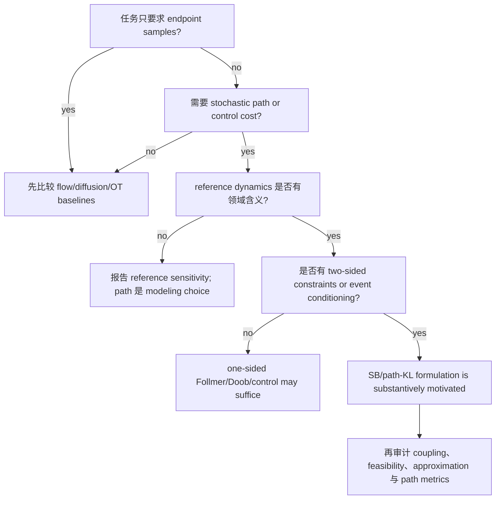

一个应用使用了 bridge drift、paired endpoints 或 conditional score，并不意味着它的收益
都来自 Schrödinger Bridge。收益还可能来自已知 dynamics、额外 pairing/lineage、可解析
conditional posterior、更大模型，或不对称的 baseline 信息。

本章不做应用名录，而问一个更严格的问题：任务是否真的需要一个相对于 meaningful
reference、满足双端约束的 path law；若需要，现有证据是否识别了这个对象？

## 1. 应用审计的七个字段

每个应用先填下面的责任链：

```text
observed data
 -> prescribed marginals
 -> observed or chosen endpoint coupling
 -> reference dynamics
 -> optimized object
 -> algorithmic approximation
 -> metric and fair baseline.                                 (1.1)
```

若其中任一项被省略，“SB 有效”就可能混合不同原因。特别要区分：

- endpoint marginals 是两个分布，endpoint coupling 是它们的 joint law；
- reference dynamics 是建模选择或物理先验，不由 marginals 唯一确定；
- paired/lineage data 是额外观测，不只是降低估计方差；
- endpoint/FID/Wasserstein 指标不验证 path KL、coupling 或 control cost；
- exact transform、population identity、finite network 和 numerical sampler 是四层对象。

## 2. Image restoration：I2SB 的收益来自什么

### 2.1 Paired conditional task

[I2SB](https://arxiv.org/abs/2302.05872 "官方论文页面")的训练数据是 paired
clean/degraded images：

```text
(X_0,X_1) ~ p_A(x_0) p_B(x_1|x_0).                            (2.1)
```

这里 pairing 是观测到的 conditional supervision，不是只给两个 domain marginals 后由
SB objective 推断出来的 coupling。I2SB 不要求已知 corruption operator，这是相对某些
inverse baselines 的优势；但 paired data 与 known operator 是两种不同额外信息，比较时
不能把二者都藏在“同样输入”后面。

### 2.2 Analytic pair-conditioned bridge

I2SB Theorem 3.1 在所写 Schrödinger system 条件下把 drifts 改写为 auxiliary linear
SDE scores。Corollary 3.2 对每个样本把一端固定为 Dirac，Proposition 3.3 在 `f=0` 时给

```text
q(X_t|X_0,X_1)=N(mu_t(X_0,X_1), Sigma_t).                     (2.2)
```

因此训练时可直接抽 conditional bridge time slice，不必模拟当前 nonlinear learned
process。这个计算收益是真实的，但范围是 pair-conditioned problem。

推理时只有 degraded `X_1`，算法用网络预测 `X_0` 并代入递归 posterior sampling。
于是 analytic (2.2) 没有消除 function-class、finite-sample、optimization 与 discretization
error。每样本 Dirac boundary 的解析式也不等于 finite network 已求解原始 unpaired
two-marginal SB。

### 2.3 Fair attribution

FID 与 classifier accuracy 检查图像输出，不检查 path KL。一个公平结论应写成：

```text
paired endpoint supervision
+ analytic conditional bridge
+ learned image prior
-> restoration performance.                                  (2.3)
```

现有比较不能把 (2.3) 的三项全部归因于“SB”。官方 I2SB repository 还是受限的 NVIDIA
non-commercial research/evaluation license，不应写成 unrestricted open source。

## 3. Single-cell：snapshots 不识别 trajectory

### 3.1 Non-identifiability before algorithms

destructive scRNA-seq 在每个时刻测量不同细胞，只近似给出 population marginals `rho_t`。
[Weinreb et al. 2018](https://doi.org/10.1073/pnas.1714723115 "官方论文页面")
说明相同 snapshot densities 可由不同 growth、noise、circulation 或 hidden-state dynamics
产生。因此

```text
{rho_t at observed times}
  does not identify individual lineage, temporal coupling or path law. (3.1)
```

SB、OT 或 ODE 都可以在这一不可识别集合中提供选择原则，但选择出的路径不能自动称为
真实生物 lineage。

### 3.2 Waddington-OT selects a state coupling

[Waddington-OT](https://doi.org/10.1016/j.cell.2019.01.006 "官方论文页面")使用相邻
snapshots、growth/death signatures 与 short-distance entropic/unbalanced OT，并在 Markov
假设下组合 couplings。它的 held-out Wasserstein validation 检查 population marginal
interpolation，不检查 individual ancestry。dynamic equilibrium 下若 `rho_t` 不变，状态
方法甚至可能把内部流动判断为 stationary。

该方法是重要 baseline，因为它把“只有 states，没有 lineage”的信息边界暴露出来；它
没有声称相对于生物校准 stochastic reference 求得完整 path-space SB。

### 3.3 Lineage changes the information set

[LineageOT](https://doi.org/10.1038/s41467-021-25133-1 "官方论文页面")还获得 late-time lineage
tree/barcodes。它先用 Gaussian diffusion-on-tree posterior 推断 ancestor locations，再做
entropic OT。C. elegans benchmark 中两种方法都获知 ground-truth growth marginals，只有
LineageOT 获得 lineage tree。

因此 convergent trajectories 上的改进是额外 lineage information 使 coupling 更可识别，
而不是 marginal-only objective 的无条件优越性。其 coupling error 比 held-out marginal
metric 更强，但仍不验证 snapshots 间任意 continuous path law。

### 3.4 Aligned pairs are a premise

[Aligned DSB](https://arxiv.org/abs/2302.11419 "官方论文页面")假设
observed pairs 是 desired static SB coupling `pi*` 的 samples，再混合 pinned Brownian
bridges。可信 alignment 可省去 coupling inference；但 `observed pairs=pi*` 是 modeling
premise。noisy、partial 或 selection-biased alignment 会改变 target，不只是增大 variance。

single-cell 的安全结论是：

```text
SB/OT objective = a selection principle under incomplete observation;
lineage/pairing  = new identifying information.                (3.2)
```

## 4. Control：reference dynamics 有物理含义时

linear covariance steering 是最清楚的应用基线。给定 plant

```text
dX_t=A_t X_t dt+B_t u_t dt+D_t dW_t,                           (4.1)
X_0~N(m_0,Sigma_0),   X_T~N(m_T,Sigma_T),
```

目标是在 controllability/feasibility 条件下最小化 control energy 并满足完整 terminal
mean/covariance。这里 reference dynamics、noise channel 与 cost 具有工程含义；SB/control
不是为了画一条任意插值曲线，而是相对于已知 plant 选择最小改动的 stochastic law。

B6 已核验 linear Gaussian covariance steering 的 Riccati/Gramian 范围和最小 fixture。
应用报告至少应同时给：

- endpoint mean/covariance residual；
- controllability 与 feasibility；
- expected control energy；
- state/control constraints 与 solver error。

只报告 endpoint fit 无法区分低能量 steering、任意高能 controller 和不满足真实 dynamics
的 generative transport。generic robotics、obstacle avoidance 或 nonlinear constrained control
需要各自来源，不能由 linear Gaussian 结果外推。

## 5. Rare events：三个 Doob-like 结论不能合并

### 5.1 Exact finite conditioning

设 reference law 为 `P`，rare event 为 `A`，committor

```text
h_t(x)=P(A|X_t=x).                                           (5.1)
```

exact Doob transform 构造的 law 就是 `Q=P(.|A)`。在 `Q` 下事件必然发生，且用于估计
`P(A)` 的 likelihood weight 为常数；这就是 zero-variance ideal。

finite derivation（补充材料暂未公开）与
说明代码（补充材料暂未公开）使用 30 步 Bernoulli random walk，
事件为累计成功数至少 18。exact event probability 为

```text
P(A)=1.8424481488582495e-6.                                  (5.2)
```


**图 5.1：** exact committor 把 rare event 变为 conditioned law 下的必然事件，并使
importance weight 成为常数；naive sampling 在同样样本量下仍有约 `2.60` 的 relative
standard error。

复跑得到 conditioned event fraction `1.0`、Doob row error `2.22e-16`、importance
estimate error `6.35e-22`。这验证 finite exact transform，不是 learned committor theorem。
事实上知道 exact `h` 往往已经解决了核心计算难题。

### 5.2 Finite-horizon KL control

[Hartmann--Schütte 2012](https://doi.org/10.1088/1742-5468/2012/11/P11004 "官方论文页面")
研究 overdamped Langevin path/hitting cost。free-energy identity 可写成

```text
F(x)=inf_Q {E_Q[W]+epsilon KL(Q|P)}.                           (5.3)
```

在 exact optimal law 下，`W+epsilon log(dQ/dP)` 为常数，连接 zero-fluctuation 与 optimal
feedback。实际算法使用 parametric feedback、gradient descent 与 milestoning；approximate
force 不再保证 constant weights。事件变常见也不等于 estimator variance 已受控。

### 5.3 Long-time driven process

[Chetrite--Touchette 2015](https://doi.org/10.1007/s00023-014-0375-8 "官方论文页面")
对 long-time additive observable 使用 tilted generator 的 spectral generalized Doob
transform。其 driven process 在 LDP、spectral gap/regularity 和 rate-function convexity
条件下，与 conditioned ensemble 在 `T->infinity` 时 logarithmically equivalent，并共享
typical values。

这不是 finite-time equality。原文明确指出 fluctuation properties 一般不同；rate function
在 conditioning value 非凸时，也未必存在对应 canonical tilt。三层关系因此是

```text
finite exact conditioning
!= finite-horizon KL-control approximation
!= long-time logarithmic ensemble equivalence.               (5.4)
```

## 6. Schrödinger--Föllmer sampling：one-sided finite-horizon transport

[Huang et al.](https://doi.org/10.1109/TIT.2024.3522494 "官方论文页面")的
Schrödinger--Föllmer sampler 从 `delta_0` 出发，把 standard Gaussian reference 通过
heat-semigroup log-gradient drift 输送到 target `mu`。若

```text
f=dmu/dN(0,I),
```

则 drift 对 `f` 的 multiplicative normalizer 不敏感，因此可处理 unnormalized target。
Proposition 2.1 在 C1--C2 下给 strong solution 与 `X_1~mu`。这是 one-sided/Dirac-start
Föllmer construction，不是两个 empirical marginals 的通用 bridge。

“不需要 ergodicity”只表示 ideal finite-horizon process 不依靠 stationary mixing。实际
Algorithm 1 用 exact drift 的 Euler--Maruyama；Theorem 4.1 给

```text
W_2(Law(Y_1),mu) <= O(sqrt(p s))                              (6.1)
```

的 discretization bound。Algorithm 2 用 inner Gaussian Monte Carlo 估 drift，Theorems
4.2--4.3 还要求 strong convexity C4、boundedness/Lipschitz 等条件。有限步、有限内样本
算法并不对任意 target exact。官方 repository 未检测到 license，只能称 source-available。

posterior moment、coverage 与 prediction accuracy 评价 sampler/application，不评价 path
KL。对 sampling 而言，这可能已是正确 metric；关键是不能把它改写成恢复 physical path。

## 7. 五类代表应用的证据矩阵

| 应用                  | SB-specific object                             | 主要额外信息                      | 可信指标                                    | 不能归因的部分                                   |
| ------------------- | ---------------------------------------------- | --------------------------- | --------------------------------------- | ----------------------------------------- |
| I2SB restoration    | pair-conditioned Dirac-boundary bridge         | clean/degraded pairs        | output FID/accuracy                     | paired supervision、network prior          |
| single-cell         | coupling/path selection under sparse marginals | growth、lineage 或 alignment  | marginal 或 lineage coupling，需分开         | individual true trajectory without labels |
| covariance steering | known-plant minimum-energy path law            | system/noise matrices       | endpoints + energy + feasibility        | generic nonlinear robotics                |
| rare-event forcing  | conditioned/change-of-measure path law         | event/cost/committor family | unbiasedness、weight variance、event rate | exactness from event frequency alone      |
| SFS sampling        | one-sided Föllmer transport                    | target energy evaluations   | `W_2`/posterior metrics                 | physical trajectory/path KL claim         |

完整的 observed-data/coupling/reference/objective/license 字段见
B13 evidence matrix（补充材料暂未公开）。

## 8. 如何判断“真正需要 SB”



图 8.1 给的是判定责任，不是方法排行榜。若只关心 samples，SB 可能仍是好算法，但“需要”
它的论证应来自 measurable gain，而不是 path language。若 reference dynamics 可解释、
两端/事件约束确实存在、control/path cost 需要最小化，SB/Doob/control 结构才承担不可替代
的建模责任。

## 9. Baseline fairness 与 license 也是证据

应用比较至少要固定：输入信息、训练数据、model capacity、compute budget 与 metric object。
本章核验出的典型不对称包括：

- I2SB 有 paired data，inverse baseline 可能有 known corruption operator；
- LineageOT 有 lineage tree，Waddington-OT 没有；
- control method 有 known plant，generic transport baseline 可能忽略 dynamics；
- rare-event proposal 可让事件频繁，但仍需正确 likelihood weights；
- SFS 不需 normalizer，但仍需估 time-dependent drift。

代码公开也不等于可复用：I2SB 是 restricted NVIDIA license；WOT 为 BSD-3-Clause；
LineageOT 为 MIT 且论文 CC BY 4.0；PBA 与 SFS repository 未检测到 license。代码 license
也不授权论文 figures、datasets 或模型权重。

## 10. 明确排除的应用族

已完成有界范围的来源核验 不是 exhaustive survey。本章明确不把以下方向写成核心成功结论：

- inverse/data assimilation：尚缺同时核验 likelihood、reference dynamics、filter/smoother
  baseline 与 optimized object 的代表链；
- generic robotics：linear covariance steering 不能覆盖任意 nonlinear constraints；
- broad molecular/scientific ML：Aligned DSB 的 paired proof of concept 不代表整族；
- graph/discrete applications：理论接口回到 B11，不在本章重复作 success claim；
- 2025--2026 single-cell frontier：正式状态、source conditions 与独立比较未闭环。

排除不是说这些方向无价值，而是现有 Bridge corpus 不授权更强归因。

## 11. 常见错误

- **“paired bridge 比 unpaired baseline 好，所以 SB 更好。”** 输入信息不同。
- **“snapshot marginals 足够恢复 cell trajectories。”** (3.1) 否定该识别结论。
- **“lineage 只是减少 sampling variance。”** 它改变可识别 coupling。
- **“endpoint fit 好就说明 controller 最优。”** 还需 dynamics、feasibility 与 cost。
- **“rare event 在 proposal 下常见就是 zero variance。”** 还需 exact likelihood weight。
- **“generalized Doob transform 都是 finite-time exact conditioning。”** (5.4) 区分三层。
- **“SFS 不需 ergodicity，所以不需假设。”** well-posedness 与算法误差条件仍在。
- **“source-available repository 就是 open source。”** 无 license 时没有已建立的复用许可。
- **“一个应用用了 score/SDE，所以收益来自 SB。”** 共享工具不等于共享 objective。

## 12. 小结与思考题

真正需要 SB 的场景通常同时具备：有意义的 reference dynamics、不能只用 endpoint samples
表达的 path/control 需求，以及两端或事件约束。即便如此，coupling、extra supervision、
exact-to-learned error 和 evaluation identifiability 仍需独立审计。

1. 给 I2SB 设计一个与 unpaired SB 公平的 comparison protocol，哪些信息必须对齐？
2. 构造两个共享 sparse cell marginals、具有不同 circulation 的 path laws；哪些观测能区分？
3. 为什么 LineageOT coupling metric 比 held-out marginal Wasserstein 更强，又仍不验证完整路径？
4. 若 rare-event committor 只近似到 `h_hat`，应报告哪些 weight/support diagnostics？
5. 比较 finite event Doob、Hartmann KL control 与 long-time driven process 的 limit object。
6. SFS 的 exact continuous drift、Monte Carlo drift 与 Euler sampler分别位于 B14 哪个误差层？
7. 为 covariance steering 设计 endpoint、energy、feasibility 和 numerical 四类指标。
8. 选择一个本章排除方向，列出使其进入下一版 core matrix 所需的最小证据链。

B14 将把这些应用层缺口放回全篇 guarantee/error stack：应用指标不能替代 problem、operator
和 approximation 的逐层保证。
